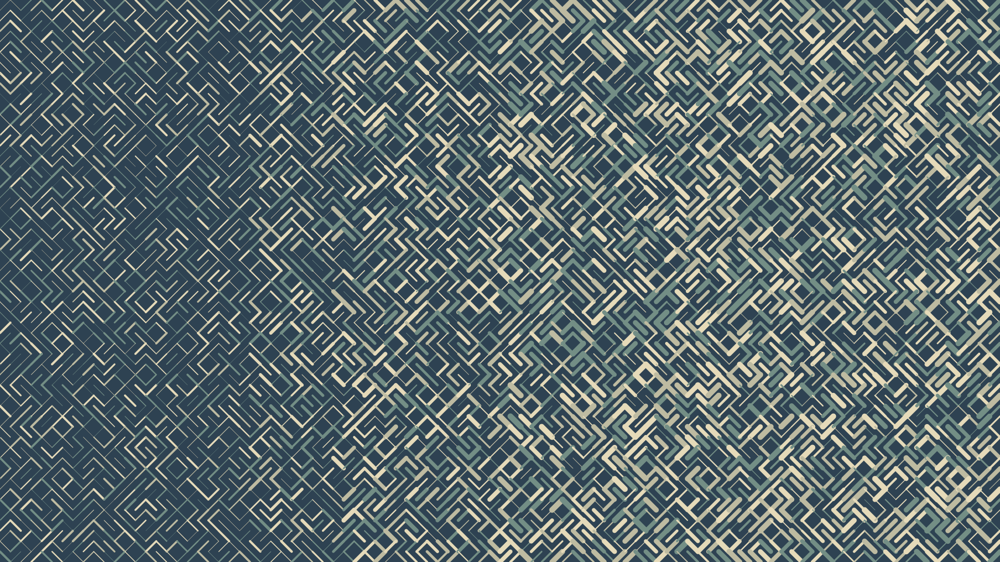

# Generative Art with Go

This repository is a collection of generative algorithms creating simple art written in Go.

**🏗️ While this is still work in progress, you can use these files to generate nice wallpapers of your own linking.**

## Generating Wallpapers

1. Clone the Repo.
2. Make changes to the width, height and size variables if needed.
3. Run `go mod download`, then `go run main.go`
4. Go to the main function and uncomment the style you want.
5. ENJOY!🥳

## Samples

### draw_line_pallet()

### draw_line_rotate()

### draw_line_stroke()

### draw_line_mixed()

### draw_lines_circles()

